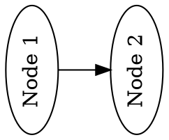

IROX-DOT
===========

*DOT Graph Description Language writer, compatible with GraphViz*

### No-STD support:

* Requires `std`

### Features:

* None

### Example:

```rust

use irox_dot::*;

fn main() -> Result<(), irox_bits::Error> {
    let mut graph = Graph::named("TestGraph");
    graph.graph_type = GraphType::Digraph;

    // add a top-level graph attribute
    graph.add_graph_attr("landscape", "true");

    // add a basic node with no attributes
    graph.add_node(Node::new("Node 1"));

    // add an edge
    graph.add_edge(Edge::new(&graph, "Node 1", "Node 2"));

    let mut out = String::with_capacity(256);
    graph.write_to(&mut out)?;
    println!("{out}");

    Ok(())
}
```
produces:
