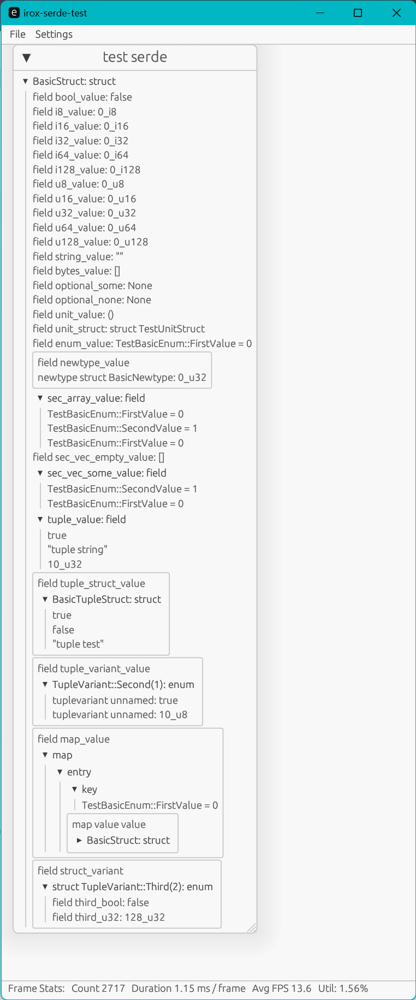
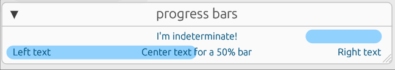
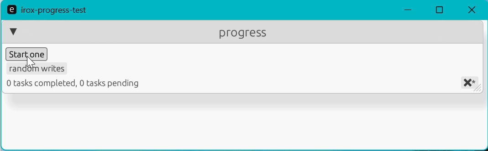

irox Extras for egui
=================================

`Stuff that should have been in egui, but isn't.`


Features
---------

### Widgets:

#### EGUI/Serde Serializer for Debugging Objects visually:



Use:

```rust
    let object = (); // your object that impls Serialize
let mut ser = EguiSerializer::new();
if let Ok(()) = obj.serialize( & mut ser) {
ser.show(ui);
}
```

In the above screenshot, `ui` is a `Window`

#### ProgressBar

Drop-in replacement of egui's ProgressBar widget with some tweaks:

* Removes the animated spinner for performance
* Adds the ability to mark the bar as 'indeterminate' and show a bouncing bar back and forth
* Adds the ability to right align, center, and left align text in the bar. These are not mutually exclusive, and you can
  have text in all three positions simultaneously.




### Frames, Apps, & Infrastructure

#### ToolFrame & ToolApp

Boilerplate bootstraps to make writing tools in egui easier. See the screenshot above for an example of the ToolFrame.

You must impl `ToolApp` to use `ToolFrame`

#### StylePersistingApp

Wraps your App impl to automatically persist your App state to disk. Requires features `serde`

#### CompositeApp

Allows you to compose multiple Apps together. The `update` method will be called sequentially, in the order the apps
are provided.
